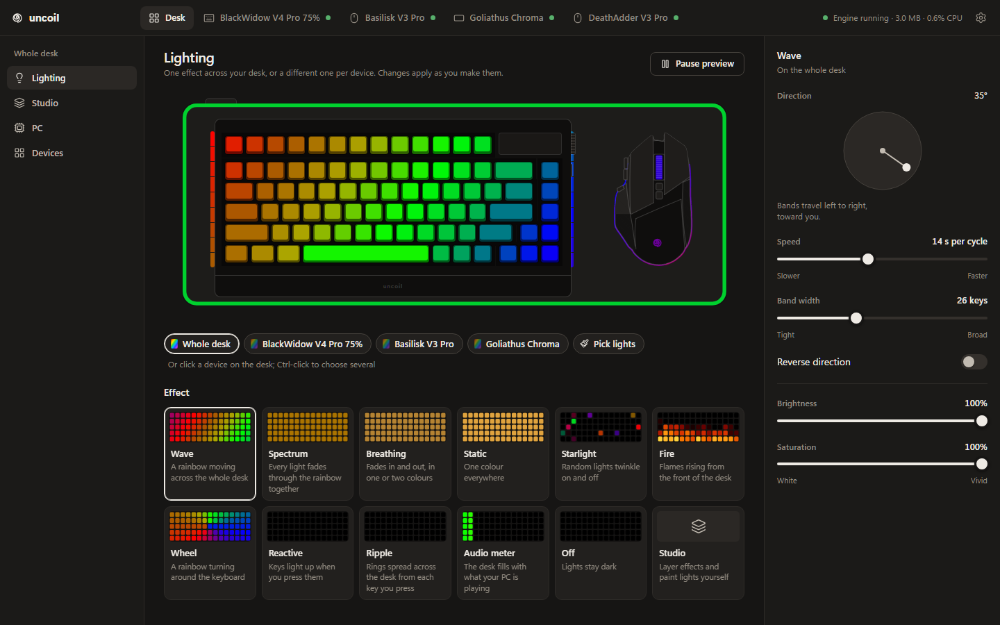

# uncoil

**A small, open-source lighting daemon for Razer peripherals on Windows. It does the part of Synapse you
actually use, in one 1.4 MB process.**

[](https://github.com/justinthevoid/uncoil/actions/workflows/ci.yml)
[](LICENSE)
[](#install)
[](CHANGELOG.md)

---

## The numbers

| | Razer Synapse 4 | uncoil (`uncoild`) |
|---|---|---|
| Processes | 17 | **1** |
| Memory | ~1.4 GB at start, leaking to multiple GB over days | **~3 MB** private |
| CPU, wave running | ~7% of a core | **<1%** of one core |
| Install size | ~500 MB | **1.4 MB**, single executable |
| Kernel drivers | yes | **none**, plain user-mode HID |

<sub>Measured on the maintainer's PC (Windows 11, BlackWidow V4 Pro 75%, Basilisk V3 Pro, Goliathus Chroma
Extended, rainbow wave running); memory and CPU on an earlier build, size on the build of 2026-10-07
(1,402,880 bytes). With live OpenRGB streaming to 350 more LEDs it showed 5 to 6 MB (2026-10-07). One
machine, not a benchmark; yours will differ. The daemon reports its own memory, CPU
and size in `status.json`, so you can check yours.</sub>

No services, no account, no telemetry; the daemon makes no network connections. The one exception is the
optional live OpenRGB mode, where it talks to OpenRGB on `127.0.0.1`, on this PC only. The optional desktop
app and the `uncoil` command line talk to the daemon over a local named pipe that only your user account can
open. The app is opened when you want to change something and closed again (or kept in the tray, if you
like). The daemon does the work.

## What it does

- **One effect across the whole desk.** Every LED has a physical position, so an angled rainbow wave flows
  from the keyboard (including its side underglow) onto the mouse and the mat as one continuous field.
- **The Razer quick effects:** wave, spectrum, breathing, static, starlight, fire, wheel, reactive, ripple and
  an audio meter, each with its own settings, plus brightness and saturation.
- **A different effect per device.** On the Lighting page, pick devices (chips, or click them on the desk;
  Ctrl-click for several) or paint lights across devices, and give them their own effect; the rest of the
  desk keeps its own. Each effect card shows the effect itself, running.
- **Studio.** Stack effects as layers with opacity, and limit each layer to the whole desk, chosen devices or
  lights you paint on any device. Reactive and ripple only ever learn where a key is, never which key it was.
- **Your devices, drawn.** The app draws each device from above as line art traced from its product photo:
  keyboards with their real case, screen and dial, mice with their buttons, mats and docks with their lights.
  With live OpenRGB, a PC page shows the motherboard, memory, graphics card, fans and cooler where they sit
  in the case, lit with the desk's effect.
- **Keys and buttons.** Remap keys on the normal and Fn layers and the mouse's buttons, set the command dial
  mode and the screen's brightness, and save a device's own (firmware) effect. These write to the device's own
  memory, so they keep working without uncoil. Every such write needs an explicit confirmation (`--write` on
  the command line) and is logged; settings that can be read back are, and the result says so.
- **Mouse settings:** DPI, DPI stages, polling rate, battery level, sleep timer and low-battery warning on
  mice whose device file lists them, using OpenRazer's shared mouse commands. DPI, stages and the poll rate
  are confirmed on the Basilisk V3 Pro (2026-10-07); the battery and sleep settings are not yet, so uncoil
  reads them first and only changes them if the read makes sense.
- **Scroll wheel settings:** tactile or free spin, scroll acceleration and Smart Reel, stored in the mouse.
  Scroll mode and Smart Reel are confirmed on the Basilisk V3 Pro (2026-10-07); acceleration still waits
  for the same read-only check, and the Basilisk V3 and V3 35K are experimental. Each device's firmware
  version, and a keyboard's layout and colour, can be read too.
- **Colour tuned for LEDs.** Uses FastLED's rainbow hue map, so no colour band looks wider or brighter than
  the rest.
- **Behaves like Synapse where it matters.** Lighting fades out when Windows turns the display off, dims with
  it, and comes back on wake. Unplugged devices are picked up again within seconds.
- **Leaves the firmware in charge.** Devices are kept in normal mode, so Fn keys, media keys and the volume
  dial work even when uncoil isn't running.
- **A command line,** `uncoil`, for status, devices, key maps (with TOML backups), the dial, the screen,
  firmware effects, DPI, polling rate, power, the scroll wheel (`uncoil scroll`) and device info
  (`uncoil info`: firmware, layout, colour). Run `uncoil help` for the full list.
- **Optional, off by default: the rest of the PC through [OpenRGB](https://openrgb.org)** (motherboard, GPU,
  RAM), if it is installed at `C:\Program Files\OpenRGB`, with `openrgb.mode`:
  - `hardware` hands the devices you list in `openrgb.devices` (there are no built-in names) to their own
    hardware modes once at sign-in, and OpenRGB exits.
  - `live` keeps OpenRGB running as a local SDK server, and the daemon sends it the desk effect, so the
    motherboard, RAM and GPU follow the keyboard. They join the desk as a "PC" column left of the keyboard,
    which you can move in the config. Razer devices are always left to uncoil.

  Both need the `-OpenRgb` install (a small elevated task; RAM sits on the SMBus, which needs administrator
  rights) and close a running OpenRGB in your session first. While the live server runs, any program on
  this PC can change that lighting too (OpenRGB's SDK has no authentication). See
  [configuration](site/src/content/docs/docs/configuration.md#openrgb) and [SECURITY.md](SECURITY.md).
- **A tray icon** while the desktop app runs: switch the effect from it and, if you choose, keep the app there
  when its window closes or start it there with Windows. The app also notifies you when a wireless device's
  battery runs low or finishes charging.

## Screenshots



<sub>The Lighting page, running on the app's built-in demo data (engine figures and device rows are synthetic in
this capture).</sub>

## Supported devices

| Device | USB PID | Lighting | Status |
|---|---|---|---|
| Razer BlackWidow V4 Pro 75% (wired) | `1532:02B3` | per-key + 18 underglow LEDs | tested |
| Razer Basilisk V3 Pro (wired / HyperSpeed dongle) | `1532:00AA` / `1532:00AB` | scroll wheel, logo, 11-LED underglow | tested |
| Razer Goliathus Chroma Extended | `1532:0C02` | 1 zone | tested |

### Experimental

These are set up from OpenRazer and OpenRGB data, and nobody has confirmed them on real hardware yet. Before
uncoil changes anything stored on one of them (key and button mappings, DPI stages, polling rate, sleep timer,
scroll wheel settings),
it reads a few settings first to make sure the device answers the way it expects; nothing is written until that
check passes. If you own one,
[tell us whether it works](https://github.com/justinthevoid/uncoil/issues/new?template=device_report.yml).
Each one is a file in [`devices/experimental/`](devices/experimental/), with the source of every value in comments.

- **Keyboards:** BlackWidow V3, V3 Pro, V3 Tenkeyless, V4, V4 Pro, V4 X, V4 75%; Huntsman V2, V2 Tenkeyless,
  V3 Pro, V3 Pro Tenkeyless, Mini; Ornata V3
- **Mice:** Basilisk V3, V3 35K, V3 X HyperSpeed; Cobra, Cobra Pro; DeathAdder V2, V3, V3 Pro; Naga V2 Pro;
  Viper Mini, V2 Pro, V3 Pro
- **Mats and accessories:** Firefly V2, Strider Chroma, Base Station V2 Chroma, Mouse Dock Pro

Adding a device is mostly a data file: USB endpoints, quirks, LED matrix and physical layout in one TOML.
See [CONTRIBUTING.md](CONTRIBUTING.md#adding-a-device) and open a
[device support request](https://github.com/justinthevoid/uncoil/issues/new?template=device_support.yml)
if you can help test.

## Install

> [!IMPORTANT]
> uncoil is pre-release (0.x). Each release on [GitHub Releases](https://github.com/justinthevoid/uncoil/releases)
> carries `uncoild.exe`, the `uncoil` CLI, the install scripts, an installer for the app and `SHA256SUMS.txt`;
> or build from source below. The binaries are not code-signed yet, so SmartScreen may warn.

**Close Synapse first.** Two programs driving the same keyboard is a race neither wins. Quit Synapse and
disable its startup entry (or uninstall it). If Synapse left a device in driver mode, uncoil puts it back
in normal mode when it connects, so the dial and media keys come back.

**Running alongside other programs.** uncoil takes the same device lock as OpenRGB (and, apparently, Razer's
own software) around every request it sends a Razer device, so two programs never mix their reports on one
device. It waits at most 25 ms for it: a lighting frame is skipped, and a command is tried once more and then
fails with "another program is talking to … right now". The lighting still fights: two programs sending
colours to one device make it flicker between them. So uncoil also looks for Razer Synapse, Razer's Chroma SDK
services, OpenRGB and SignalRGB by process name every 5 seconds, logs each once and shows a notice in the app
(and in `uncoil status`). OpenRGB started by uncoil's own live mode doesn't count.

```powershell
# from a release: in the folder with uncoild.exe and install-task.ps1 (check them against SHA256SUMS.txt)
powershell -ExecutionPolicy Bypass -File .\install-task.ps1
# or from a clone, after building (see below)
powershell -ExecutionPolicy Bypass -File scripts\install-task.ps1
```

The daemon runs as you, **unelevated**. The script asks for one UAC prompt only to copy `uncoild.exe` to
`%ProgramFiles%\uncoil`, where only administrators can write (so no program running as you can swap it); it
checks the copy's SHA-256, registers a logon task named `uncoil` and starts it. Two options:

- `-OpenRgb` also registers `uncoil-openrgb`, an elevated task that runs at logon for motherboard, GPU and
  RAM lighting through OpenRGB (RAM sits on the SMBus, which needs administrator rights): in `hardware` mode
  it hands the devices over once and exits; in `live` mode it keeps OpenRGB running as uncoil's SDK server
  on `127.0.0.1`. It also creates the admin-only folder `%ProgramData%\uncoil\openrgb` for OpenRGB's
  settings. It does nothing until you set `openrgb.mode` in the config.
- `-Elevated` runs the daemon itself elevated, as older installs did. It is a fallback for a PC where the
  daemon cannot open its devices unelevated (none seen so far).

See [SECURITY.md](SECURITY.md) for what runs elevated and why. The script installs only the daemon: the
`uncoil` CLI (`target\release\uncoil.exe`) runs from wherever you put it, and the desktop app has its own
installer.

The app's **Tray & notifications** page has its own options: keep it in the tray when the window closes, and
start it in the tray with Windows. The second adds a per-user startup entry (the `Run` key under your
account) that launches `uncoil-app.exe --tray`; turning it off removes the entry. Battery notifications are
on by default: once when a wireless device reaches the level you choose (20 % unless you change it), once more
at 10 %, and once when charging reaches 100 %, checked every 10 minutes while the app is open or in the
tray. Only one copy of the app runs; starting it again shows the open window.

To remove it:

```powershell
powershell -ExecutionPolicy Bypass -File scripts\uninstall-task.ps1   # both tasks, the binary, %ProgramData%\uncoil
Remove-Item -Recurse "$env:LOCALAPPDATA\uncoil"   # status, log and the onboard-write journal
Remove-Item -Recurse "$env:APPDATA\uncoil"        # your settings and extra device files
```

The uninstaller removes nothing in your user profile; the last two lines are for a clean slate.

Anything uncoil wrote into a device's own memory (key maps, a saved firmware effect, DPI stages) stays there.

### Files

| Path | What |
|---|---|
| `%APPDATA%\uncoil\config.json` | settings; edited by the app, hot-reloaded by the daemon |
| `%APPDATA%\uncoil\devices\*.toml` | extra or overriding device definitions, read at start |
| `%APPDATA%\uncoil\app.json` | the desktop app's own preferences (tray, start with Windows, battery notifications); the daemon never reads it |
| `%LOCALAPPDATA%\uncoil\status.json` | live device and engine status, read by the app |
| `%LOCALAPPDATA%\uncoil\uncoild.log` | daemon log, trimmed at 256 KB |
| `%LOCALAPPDATA%\uncoil\onboard-writes.jsonl` | one line per write to a device's memory; `keymap reset` restores from it |
| `%ProgramFiles%\uncoil\uncoild.exe` | the installed daemon (and `install.log`, what the last install did) |
| `%ProgramData%\uncoil\openrgb` | OpenRGB's settings (`OpenRGB.json`) for the hand-off or the live server, administrators only (`-OpenRgb` or `-Elevated` installs) |

## Build from source

Requirements: Windows 10/11 x64, [Rust](https://rustup.rs) stable (1.85 or newer, MSVC toolchain with the
Visual Studio C++ build tools). For the desktop app also Node.js 22, [pnpm](https://pnpm.io) and the
WebView2 runtime (already on Windows 11); see the [Tauri prerequisites](https://v2.tauri.app/start/prerequisites/).

```powershell
git clone https://github.com/justinthevoid/uncoil
cd uncoil

# daemon and CLI
cargo test -p uncoil-core -p uncoil-hid -p uncoild -p uncoil-cli -p uncoil-openrgb
cargo build --release -p uncoild -p uncoil-cli      # target\release\uncoild.exe, target\release\uncoil.exe

# desktop app (optional)
cd apps\uncoil
pnpm install
pnpm tauri dev                                      # live-reloading app window
pnpm tauri build                                    # release build + NSIS installer
```

`pnpm dev` alone serves the app UI in a browser against a mock with the real desk geometry, which is handy
for design work without hardware. Notifications from a dev build (`pnpm tauri dev`) show under PowerShell's
name and icon, because the app isn't installed; an installed build shows its own.

### Layout

```
crates/uncoil-core    protocol, colour, effects, device definitions, desk layout, pipe types (pure, unit-tested)
crates/uncoil-hid     USB HID transport with per-device quirks and the shared Razer device lock; display-power
                      watcher; key and audio listeners
crates/uncoil-openrgb a small OpenRGB SDK client for live mode (std only, 127.0.0.1 only)
apps/uncoild          background daemon (no window); serves the control pipe \\.\pipe\uncoil
apps/uncoil-cli       the `uncoil` command line, a client of that pipe
apps/uncoil           desktop app: Tauri 2 + SvelteKit + Tailwind; its preview runs the real effect code
devices/*.toml        one data file per device: USB endpoints, quirks, LED matrix, physical layout
devices/experimental  experimental device files, generated by tools/devices/ from OpenRazer / OpenRGB data
docs/PROTOCOL.md      how the protocol was learned, and the hardware quirks
docs/ARCHITECTURE.md  how the daemon, the pipe and its clients fit together
tools/reference       Python probes and log-mining scripts used for reverse engineering
tools/art             the device drawings: traced from product photos (photos are never committed)
```

## How it works

Razer peripherals take one 90-byte HID feature report per command: a class, an id, up to 80 bytes of
arguments and an XOR checksum. The format is public thanks to [OpenRazer](https://github.com/openrazer/openrazer)
and [OpenRGB](https://gitlab.com/CalcProgrammer1/OpenRGB); uncoil re-implements it from those facts and from
Synapse's own logs, which record every command it sends with a name and the raw bytes.

`uncoild` places each device on a virtual desk, samples the effect at every LED's physical position, and
streams custom frames (30 fps by default; measured on the maintainer's PC on 2026-10-07: the mouse and mat
at 29.7, the BlackWidow, which acknowledges every report, at about 18), respecting per-device quirks (the BlackWidow wants every reply
read back, or it quietly stops listening). Other commands from the app or the CLI run on the same device
thread between frames. The full write-up, with the expensive lessons, is in
[docs/PROTOCOL.md](docs/PROTOCOL.md); how the code fits together is in
[docs/ARCHITECTURE.md](docs/ARCHITECTURE.md).

**The Fn layer lives in the keyboard.** The BlackWidow stores its Fn layer in onboard memory. Fn+P has
Print Screen printed on the keycap but does nothing without Synapse, because that slot is empty. Writing
one key code into it makes Fn+P a native Print Screen, handled by the firmware, on any PC, with nothing
running: `uncoil keymap set keyboard P key PRINT_SCREEN --layer fn --write`, or the app's Keys page.

## Roadmap

Nothing here has a date.

- **Command dial and OLED:** the dial's per-mode functions and custom images for the BlackWidow's screen
  (today: the active dial mode and the screen's brightness).
- **Profiles:** named sets of effect and device settings, and switching onboard profiles.
- **More devices:** confirming the experimental ones, community device files and a guided, privacy-safe
  capture tool.
- **Per-app profiles:** switch lighting when a given program is in front.
- **Releases:** published binaries and an installer that sets up the daemon.

## Contributing

Bug reports, device data and protocol findings are all welcome. Start with [CONTRIBUTING.md](CONTRIBUTING.md);
it covers the dev setup, the device-file path and the reverse-engineering rules. The short version of those
rules: **never commit HID captures that contain keystrokes, Synapse logs or device serial numbers.**

Everyone taking part agrees to the [Code of Conduct](CODE_OF_CONDUCT.md). Security issues go through
[SECURITY.md](SECURITY.md), not public issues. Questions: [SUPPORT.md](SUPPORT.md).

## Support

uncoil is free and stays free. Starring the repository, filing a careful bug report or contributing a
device file all help more than you'd think.
<!-- Add a sponsor link here once GitHub Sponsors / Ko-fi is set up and .github/FUNDING.yml is filled in. -->

## License and trademarks

uncoil is free software under the [GNU General Public License v3.0 or later](LICENSE). Protocol facts and
some device data derive from OpenRazer and OpenRGB (both GPL-2.0-or-later); the keyboard key-mapping
commands were cross-checked against [OpenSynapse](https://github.com/A1mAssist/OpenSynapse) (MIT).
The binaries also carry other people's code under their own licences (Rust crates, the app's front end,
FastLED's rainbow hue map); [THIRD_PARTY_NOTICES.md](THIRD_PARTY_NOTICES.md) lists them, and ships with
each release and the app.

uncoil is an independent project. It is not affiliated with, endorsed by or sponsored by Razer Inc.
"Razer", "Synapse", "Chroma", "HyperSpeed" and the device names used here ("BlackWidow", "Basilisk",
"Goliathus" and the rest) are trademarks of Razer Inc., used only to identify compatible hardware and
software.

